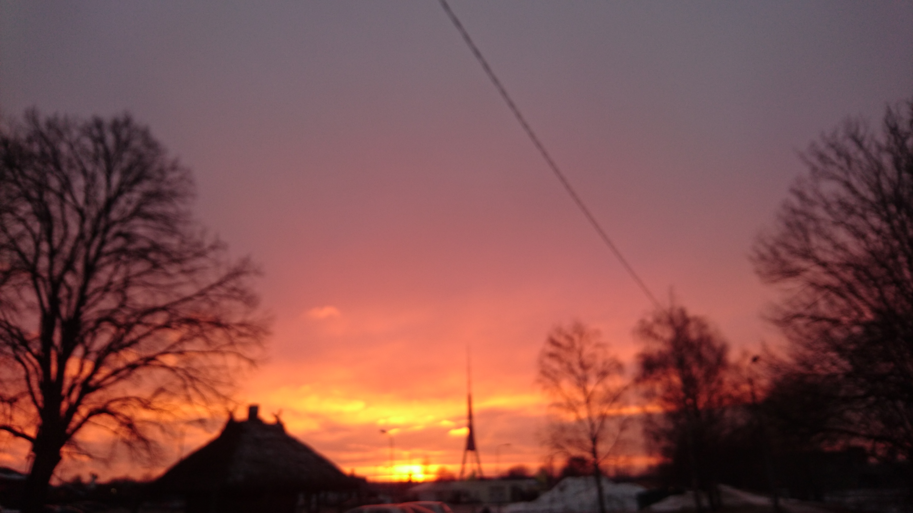

# martins.rudevics

## About me

Mani sauc Mārtiņš un esmu 34 gadus vecs, precējies, bērnu nav. Dzīvoju 
pašlaik Čiekurkalnā, bet orģināli nāku no kūrotpilsētas - Jūrmalas. 
Esmu pabeidzis Latvijas Lauksaimniecības Universiāti - Vides un ūdenssaimniecības
specialitati iegūstot bakalaura grādu Vides inženierijā. 

Pēdējos jau 10 gadus strādāju uzņēmumā, kas tirgo un ražo notekūdeņu attīrīšanas 
iekārtas un sūkņu stacijas.

Manos darba pienākumos ietilpst: 
- nepieciešamo materiālu pasūtīšana;
- rasējumu sagatavošana priekš klientiem izmantojot - ZWCad;
- notekūdeņu iekārtu salikšana;
- sūkņu staciju izgatavošana;
- darbam nepieciešamo detaļu sagatavošana izmantojot CNC frēzi.

Viena no interesantākajām lietām, ko esmu apguvis šajā darbā ir galvenotkārt polietilēna,
bet arī polipropilēna metināšanu.

Pēdējos 2 gadus savā brīvajā laikā apgūstu IT nozari - konkrētāk programmu testēšanu.
Esmu veiksmīgi ieguvis ISTQB Certified Tester - Foundation Level sertifikātu.
Esmu apguvis nedaudz Java programmēšanas valodu, jo vēlme nākotnē bija apgūt automatizēto 
testēšanu. 

Nesen beidzu QA kursu, kurus organizēja Brainnest Consulting kompānija, šajos kursos apguvu
kā izmantot JIRA - kļūdu ziņojumu aprakstīšanā un QASE - testpiemēru izveidošanā. 
Kā arī apguvu citus nepieciešamos pamatus.

Aptuveni jau gadu brīvajos brīžos piedalos mazos testa ciklos - utest.com. Kuros ir sanācis
testēt gan web lapas, gan aplikācijas. Šajā vietnē es izpildu testapiemērus, rakstu atrasto
kļūdu ziņojumus kā arī veicu exploratory testēšanu.

Brīvajā laikā patīk braukt ar riteni un noskatīties kādu labu filmu.

Šis ir mans [LinkedIn](https://www.linkedin.com/in/m%C4%81rti%C5%86%C5%A1-rudevics-595a33164/) profils.

    
